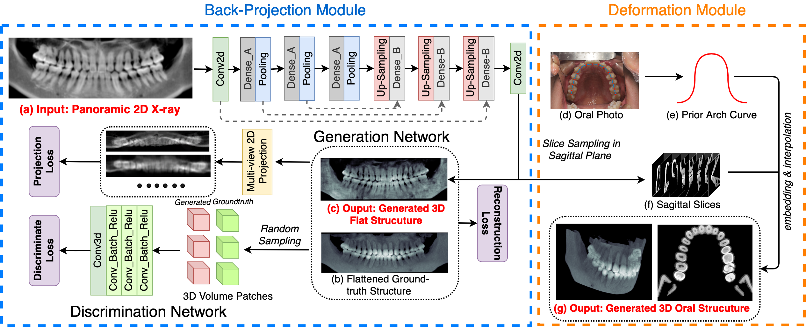

# Oral-3D
 This is the official implementation of paper: 
 
[Oral-3D: Reconstructing the 3D Structure of Oral Cavity from Panoramic X-Ray](https://ojs.aaai.org/index.php/AAAI/article/view/16135)

## Model Overview
Oral-3d is a GAN-based model that learns to generate 3D oral structure from panoramic X-ray image



 ## Set up environemnt
 ```
 conda create -n Oral_3D
 conda activate Oral_3D
 pip install -r requirements.txt
 ```

 ## Data Format
 We assume that all the required data is saved in .mat file. An example case be seen seen in ./data/mat
 A mat file is expected to contain below fields:

```
# Given the CBCT in [256, 288, 160]
CBCT: [256, 288, 160] # CBCT data after pre-processing
MPR: [80, 160, 576] # Flattened 3D image used for training
Case_ID: [1] # ID of the case for saving generation image.
PriorShape: [577, 2] # Shape of the dental arch
Ideal_PX: [160, 576] # The Panoramix X-ray Image
```

## Train
We assume all the required .mat files are store under {data_root}. If there is no split file under the directory, the dataset will split the
data in a ratio of 3:1:1 for training, validation, and test and save this in split.csv under {data_root}. Or else the dataset will load the
training, validation, and test data according to existing split.csv.

To train the model, the user could run by:
```
python main.py --mode train --data_root {data_root}
```

 ## Test
To test the model, we assume the data is saved as in the same format as in Data Format with the split.csv file.
 ```
 python main.py --mode test
 ```
The user could add ```--test_only``` option to skip loading train and val data


## License and Citation
```
@inproceedings{song2021oral,
  title={Oral-3d: Reconstructing the 3d structure of oral cavity from panoramic x-ray},
  author={Song, Weinan and Liang, Yuan and Yang, Jiawei and Wang, Kun and He, Lei},
  booktitle={Proceedings of the AAAI conference on artificial intelligence},
  volume={35},
  number={1},
  pages={566--573},
  year={2021}
}
```
